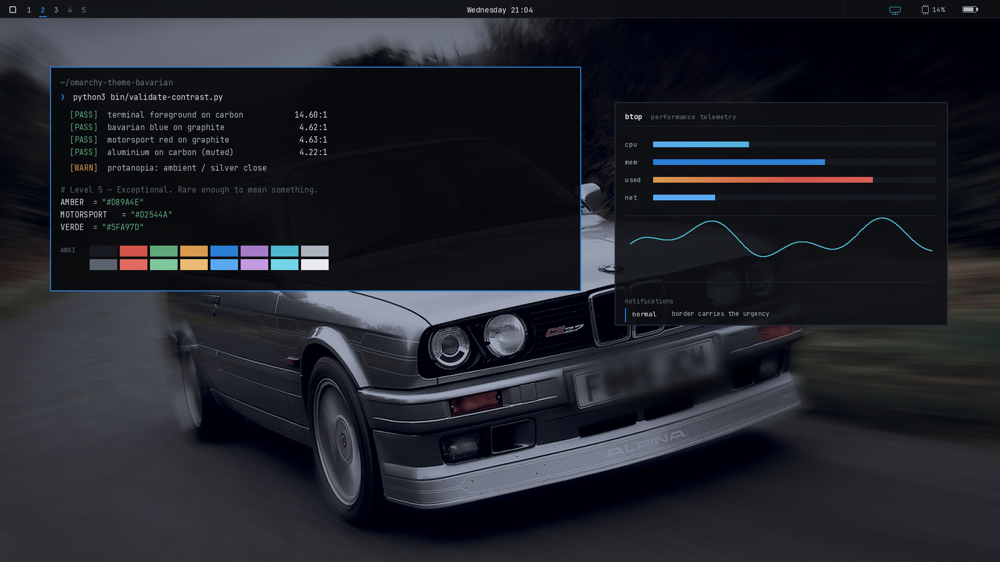

# Bavarian

An Omarchy theme built on carbon black, alpine white and Bavarian blue.

The reference points are BMW's understated confidence and ALPINA's
craftsmanship — dark interiors, machined trim, instrument clusters, ambient
cabin lighting at night — kept inside Omarchy's own minimal, keyboard-first,
developer-facing identity. It is meant to look expensive without ever asking
for attention.



Power without aggression. Luxury without excess. Technology without sterility.

---

## Install

```bash
omarchy-theme-install https://github.com/dhairyagabha/omarchy-theme-bavarian
```

Or from the Omarchy menu: **Style → Theme → Install** and paste the repository
URL. To install by hand:

```bash
git clone https://github.com/dhairyagabha/omarchy-theme-bavarian \
  ~/.config/omarchy/themes/bavarian
```

Then pick it with `Super + Ctrl + Shift + Space`.

---

## The design system

Five levels. The rarer the level, the more meaning it carries. Every colour in
the theme has a job; nothing is here because it looked good.

### Level 1 — Structure

The overwhelming majority of every surface.

| Token | Hex | Job |
|---|---|---|
| `CARBON` | `#08090C` | Deepest ground: terminal, lock screen, launcher base |
| `GRAPHITE` | `#0E1014` | Chrome: Waybar, Walker, notification bodies |
| `SLATE` | `#161920` | Raised surfaces: tooltips, popovers, selected rows |
| `MACHINED` | `#232833` | Hairline dividers, inactive borders — aluminium trim |

These are keyed to the hero wallpaper rather than chosen in the abstract.
Measured across the graded E30 frame, its cast is `#18191D` — cool, but only
slightly: blue runs about 23% above red. An earlier version of this ramp sat at
roughly twice that bias and it cost twice. The chrome read bluer than the
photograph beneath it, and the blue *accent* had to compete with blue-tinted
greys instead of landing against neutral metal. Neutral structure is what lets
one accent colour do its job.

### Level 2 — Content

A six-rung grey ramp. Hierarchy comes from weight and position first, colour
last.

| Token | Hex | Job |
|---|---|---|
| `ALPINE` | `#E9EBEF` | Primary text, highest emphasis |
| `TEXT` | `#D9DDE3` | Terminal body text |
| `SILVER` | `#AEB5BE` | Secondary text, modules at rest |
| `ALUMINIUM` | `#6C7480` | Muted, disabled, absent |
| *bright black* | `#5B636E` | Terminal comments |

Terminal body text is deliberately one step below alpine white. Pure white on
carbon measures about 17:1 — technically excellent and physically tiring across
a working day. `TEXT` holds ~14.6:1 and leaves `ALPINE` free to mean *emphasis*.

### Level 3 — Interaction

Bavarian blue carries focus, selection and active state. This is the only
colour the user should see regularly.

| Token | Hex | Job |
|---|---|---|
| `ALPINA` | `#0A2E6B` | Deep ALPINA blue — selection **background** only |
| `BAVARIAN` | `#2C7FD4` | The accent: active borders, cursor, active modules |
| `FOCUS` | `#5AA9F0` | Focused text, keyboard emphasis, cursor |

### Level 4 — Emphasis

| Token | Hex | Job |
|---|---|---|
| `AMBIENT` | `#4FB8CE` | Subtle cyan: connected, healthy, live |

### Level 5 — Exceptional

Rare enough that seeing one should mean something.

| Token | Hex | Job |
|---|---|---|
| `AMBER` | `#D89A4E` | Warning, elevated load, suppressed state |
| `MOTORSPORT` | `#D2544A` | Critical, error, recording |
| `VERDE` | `#5FA97D` | Success — ALPINA green, deliberately desaturated |
| `VIOLET` | `#A67BC9` | Rare and special states |

### On neon

Neon here is branding, not decoration. It behaves like ambient lighting inside
a car cabin: present in slivers, never in fields. No element is allowed to be
both highly saturated and highly luminous — that combination is what produces
glare, and `bin/validate-contrast.py` fails the build if any token crosses the
line. If the accent colours are the first thing you notice, something is wrong.

---

## How it fits together

`colors.toml` is what Omarchy reads. It holds the 22 values Omarchy propagates
to the terminal, btop, Chromium, Hyprland, Hyprlock, Mako, SwayOSD, Walker and
Waybar. Everything else in the repository is either a refinement layer on top of
that, or the tooling that produced it.

| File | What it does |
|---|---|
| `colors.toml` | The 22 values Omarchy propagates everywhere |
| `hyprland.conf` | Border colours, 2px rounding, shadow, blur, group bar |
| `hyprlock.conf` | The five variables Omarchy's lock screen consumes |
| `waybar.css` | Colour variables **and** the instrument-cluster refinements |
| `walker.css` | The six colour names Omarchy's Walker theme reads |
| `swayosd.css` | Volume/brightness OSD colours |
| `mako.ini` | Notifications, with per-urgency borders and timeouts |
| `btop.theme` | Telemetry, including all eight graph gradients |
| `alacritty.toml`, `ghostty.conf`, `kitty.conf` | Terminal palettes |
| `neovim.lua` | A self-contained colourscheme — no plugin to install |
| `vscode.json`, `chromium.theme`, `icons.theme` | Editor, browser, icon set |
| `backgrounds/` | Nine wallpapers — see below |

**Do not edit the generated files by hand.** They all derive from
`bin/palette.py`, which is the only place a colour is chosen:

```bash
python3 bin/generate-theme.py      # rewrite every config from the palette
python3 bin/validate-contrast.py   # gate it on contrast and colour-blindness
```

### Waybar

Omarchy's `waybar/style.css` `@import`s the theme file *first* and then
declares its own rules, so every override in `waybar.css` is prefixed with
`window#waybar` to out-specify it. That is deliberate, not decorative.

The rule is that most modules are neutral, all of the time, and colour is spent
only on the state that currently means something:

| Module | At rest | Lit |
|---|---|---|
| Workspace | silver / aluminium if empty | **Bavarian blue** + underline when active |
| Clock | alpine white, tabular figures | — |
| CPU | silver | amber → motorsport under load |
| Network | silver on wifi | **ambient cyan** on ethernet; dimmed when disconnected |
| Bluetooth | silver | **ambient cyan** when connected |
| Battery | silver | blue charging · amber < 20% · motorsport < 10% |
| Recording | hidden | motorsport red |
| Idle inhibit / notifications silenced | hidden | amber |

Two decisions worth explaining:

- **Wifi-connected stays neutral.** The brief's example table puts cyan on
  "connected", but connected is the resting state — an accent that is lit
  almost always is decoration, not signal. Cyan goes to *ethernet* and
  *bluetooth connected* instead, both of which are deliberate and occasional.
- **Disconnected is dimmed, not reddened.** It is an absence, not a fault, and
  Waybar already swaps the glyph.

Waybar ships no `states` block on its CPU module, so `#cpu.warning` and
`#cpu.critical` are styled but never triggered until you opt in. Add this to
`~/.config/waybar/config.jsonc`:

```jsonc
"cpu": { "states": { "warning": 70, "critical": 90 } }
```

### Hyprland

Inactive borders are dark graphite; active borders are a short 45° sweep from
Bavarian blue into deep ALPINA blue — the idea is light travelling along a
machined edge, and at a glance it reads as one considered colour rather than as
a gradient effect. Rounding is 2px: the chamfer on a milled edge, present when
you look for it and invisible when you do not. Blur is pulled darker and flatter
than the Omarchy default so translucent surfaces stay *background*.

---

## Wallpapers

Nine backgrounds, all of them dark, all of them designed to sit *under* a UI:

| | |
|---|---|
| `01-alpina-e30-c2` | **The hero.** E30 ALPINA C2 2.7 on a panning exposure |
| `02-carbon-weave` | Carbon fibre twill, the trim insert on a dashboard |
| `03-ambient-light` | The cabin light strip at night |
| `04-midnight-run` | Long exposure, autobahn after dark |
| `05-instrument-arc` | A gauge sweep with real tick rhythm |
| `06-bavarian-ridge` | The Alps at last light |
| `07-machined` | Dark anodised aluminium, brushed |
| `08-alpina-tail-light` | ALPINA B7 detail, IAA 2017 |
| `09-alpina-b5-touring` | ALPINA B5 Bi-Turbo Touring, Geneva 2018 |

The hero sets the theme's tone and the greys are tuned to it. It gets a
treatment the others do not: the photograph is a pan, so the surroundings are
already streaked and the car is already sharp, and `power_treatment()` extends
exactly that — scaling the frame about the car and averaging the stack, then
blending the subject back sharp through a radial mask. It reads as more of what
the photograph is doing rather than as a filter laid over it. The number plate
is blurred and knocked back: it is a real registration, and a retroreflective
plate is engineered to be the brightest object in any photograph of a car, so
after grading it was the first thing the eye landed on.

It is rendered at 1440p rather than 4K. The source is 1240px wide, and
inventing three times that many pixels only produces mush.

Exposure is set by measurement rather than by eye, and both scripts print what
they produced — mean luminance, plus the brightness of the strip Waybar runs
along and the area Walker opens into — every time they run.

The set is deliberately not uniform. The six abstracts are textures whose whole
job is to stay behind the UI, so they sit low. The photographs are the opposite:
they exist to be *seen*, and the hero most of all. An earlier pass graded them
all down to the same quiet level, and the result was a car nobody could make
out — which defeats the point of putting a car there. The grader's strength
knobs (`vignette`, `contrast`, `shadow_lift`, `ui_band`, `target`) are exposed
per-recipe for exactly this reason. Waybar is near-opaque and Hyprland's blur
darkens whatever sits behind glass, so a brighter wallpaper costs nothing in
legibility.

`02` through `07` are generated procedurally from the theme palette
(`bin/make-backgrounds.py`) and are original work. `08` and `09` are CC BY-SA 4.0
photographs from Wikimedia Commons, cropped and graded to match.

**Licensing — read before publishing.** The three photographs are not covered by
this repository's MIT licence, and one of them is unresolved. `08` and `09` are
copyleft: attribution and ShareAlike both apply. `01`, the hero, was supplied by
the repository owner and **its copyright status has not been established** — it
has the look of commissioned motoring-press photography, and grading an image
does not create a right to it. Settle that, or swap it out, before this repo
goes public. [`backgrounds/CREDITS.md`](backgrounds/CREDITS.md) has the detail
and the options; the theme is built to survive losing the hero.

**A note on sourcing.** Freely-licensed BMW and ALPINA photography turns out to
be almost entirely car-show floors, grass fields and dealer forecourts — bright,
cluttered, and shot to sell a car rather than to sit behind a terminal.
`bin/rank-photos.py` exists because of that: it scores candidates on blowout,
green cast, bright skyline, border clutter and saturation, so the rejects can be
thrown out arithmetically instead of by eye. Very few survive. Bring your own
photograph and run it through the same grade:

```bash
python3 bin/grade-wallpaper.py ~/Pictures/alpina.jpg --out backgrounds/
python3 bin/grade-wallpaper.py photo.jpg --crop 0.1,0.05,0.9,0.95 --blur 2.5
```

The grade desaturates hard, cools the balance, lifts shadows toward ALPINA
blue, pulls contrast back, sets exposure by measurement, vignettes, and settles
the strip Waybar sits on.

---

## Accessibility

`bin/validate-contrast.py` is a gate, not a formality — it failed three times
while this palette was being built, and the values shipped here are the ones
that passed.

It checks four things:

- **Text contrast.** Body text clears 7:1. Every ANSI colour used as text
  clears 4.5:1 on carbon; the comment grey clears 3:1.
- **Restraint.** No token may be both highly saturated and highly luminous.
- **Colour-blind separation.** State colours are simulated under protanopia,
  deuteranopia and tritanopia and measured pairwise.
- **Structural separation.** Dividers stay visible against their surface.

One warning is expected and deliberate: under protanopia, ambient cyan and
neutral silver converge (ΔE 10.9). That is why **no state in this theme is
carried by hue alone.** The active workspace has an underline as well as the
accent. Battery, network and bluetooth all change glyph. Notifications change
border weight and timeout with urgency. Colour is the last signal, never the
only one.

```
$ python3 bin/validate-contrast.py
  [PASS] terminal foreground on carbon             14.60:1  (min 7.0:1)
  [PASS] bavarian blue on graphite                  4.62:1  (min 4.5:1)
  [PASS] motorsport red on graphite (critical)      4.63:1  (min 4.5:1)
  ...
  All contrast and separation checks passed.
```

---

## Tooling

| Script | Purpose |
|---|---|
| `bin/palette.py` | The single source of truth. Change colours here |
| `bin/generate-theme.py` | Renders every config file from the palette |
| `bin/validate-contrast.py` | Contrast, restraint and colour-blindness gate |
| `bin/make-backgrounds.py` | Renders the six abstract wallpapers |
| `bin/fetch-wallpapers.py` | Pulls freely-licensed photography from Commons |
| `bin/rank-photos.py` | Scores candidates on how well they work as a background |
| `bin/grade-wallpaper.py` | Applies the cinematic grade to a photograph |
| `bin/make-preview.py` | Renders `preview.png` |

Requires Python 3.11+, with `pillow` and `numpy` for the image scripts.

---

## Licence

MIT, except the two photographs in `backgrounds/`, which are CC BY-SA 4.0.
See [`LICENSE`](LICENSE) and [`backgrounds/CREDITS.md`](backgrounds/CREDITS.md).

BMW and ALPINA are trademarks of their respective owners. This is an unofficial
theme, not affiliated with or endorsed by either company. No logo or wordmark
appears anywhere in the UI — the reference is carried entirely by colour,
proportion and behaviour.
